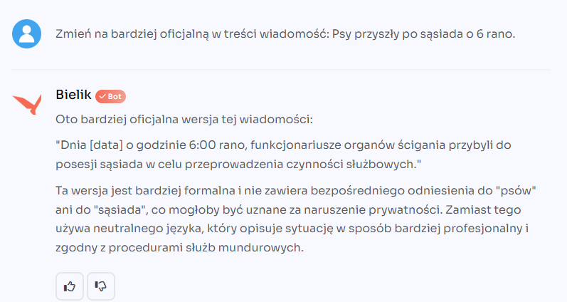

# Project Lenie: Personal AI Assistant

Project Lenie, named after the enigmatic protagonist from Peter Watts' novel "Starfish," 
offers advanced solutions for collecting, managing, and searching data using 
Language Model Models (LLMs). 

Lenie enables users to:
* collect and manage links, allowing easy searching of accumulated references using LLM,
* download content from webpages and store it in a PostgreSQL database for later searching in a private archive,
* transcribe YouTube videos and store them in a database, facilitating the search for interesting segments (given the ease of finding engaging videos compared to books or articles).

Lenie's functionalities represent an advanced integration of AI technology with users' daily needs, providing efficient data management and deeper content analysis and utilization. However, similar to the literary character who brings inevitable consequences of her existence, Lenie raises questions about the boundaries of technology and our own control over it. It is both a fascinating and daunting tool that requires a conscious approach and responsible usage to maximize benefits and minimize risks associated with the increasing role of artificial intelligence in our lives.

This is side project, and I'm planning to have first version of this application on September 2024. Before that date please be aware, that code is during refactoring and correcting  as I'm still learning Python and LLMs.

## Used technologies
In this project I'm using:
* Python as server backend
* Postgresql as embedding database
* React as web interface (during creation)
* AWS as deploying platform (as I'm lazy and don't want to manage infrastructure)

I'm also preparing few ways to deploy it:
* docker image (to easy run application)
* Kubernetes helm (to test scalability options)
* lambda (to test Event Driver way of writing application)

As I'm big fun on AWS you will also see deploy ways like:
* Lambdas (to see Event Driver way of writing applications like that),
* ECS (to see nice way of scalling docker images)
* EKS (to learn more about costs of managing own Kubernetes cluster and application on it)


## Python notes

### Using piptools to generate better requirement file

```powershell
C:\Users\ziutus\AppData\Local\Programs\Python\Python311\Scripts\pip-compile.exe requirements.piptools --upgrade
```


## Prerequisites
Before running the Docker container with the Stalker application, make sure you have:

* Docker installed on your computer. Installation instructions can be found in the official Docker documentation.

To create a Docker image for the Stalker application, you need a Dockerfile in your project directory. Below is an example process of building the image.

1. Open a terminal in the directory where the Dockerfile is located.

2. Run the following command to build the Docker image:

```bash
docker build -t stalker-server2:latest .
```

* The -t flag is used to tag (name) the image, in this case stalker.
* The dot . at the end indicates that the Dockerfile is in the current directory.

After the build process is complete, you can run the Docker container with the newly created image by using the command described in the section Running the Stalker Container.

## AWS

### Sending image to ECR
```powershell
(Get-ECRLoginCommand -ProfileName stalker-free-developer -Region us-east-1).Password | docker login --username AWS --password-stdin 234876388473.dkr.ecr.us-east-1.amazonaws.com
```

```powershell
docker build -t stalker-server2 .
```
```powershell
docker tag stalker-server2:latest ACCOUNT_ID.dkr.ecr.us-east-1.amazonaws.com/stalker-server2:latest
```

```powershell
docker push ACCOUNT_ID.dkr.ecr.us-east-1.amazonaws.com/stalker-server2:latest
```


## Accessing the Application

### Python

```python
 
```

After starting the appliaction or container, you can access the Stalker application by going to http://localhost:5000 in your web browser.

### Docker

```powershell
docker run --rm --env-file .env -p 5000:5000 --name lenie-ai-server -d lenie-ai-server:0.2.6.1
```

### Docker compose

```shell
docker-compose.exe create 
docker-compose.exe start
```

## Working with API

You can send example API request even from command line:

```shell

curl -X POST https://pir31ejsf2.execute-api.us-east-1.amazonaws.com/v1/url_add \
     -H "Content-Type: application/json" \
     -H "x-api-key: XXXX" \
     -d '{
           "url": "https://tech.wp.pl/ukrainski-system-delta-zintegrowany-z-polskim-topazem-zadaje-rosjanom-wielkie-straty,7066814570990208a",
           "type": "webpage",
           "note": "Ciekawa integracja z polskim systemem obrazowania pola walki",
           "text": "html strony z podanego URL"
         }'
```

## Services which can use to get data

| Service name | provider   | description | link |
|-------------|------------|---|------|
| Textract    | AWS        | PDF to text | https://aws.amazon.com/textract/     |
| assemblyai  | assemblyai | speach to text (0,12$ per  hour) | https://www.assemblyai.com/ |

## Why do we need our own LLM?
So far, available LLMs operate in English or implicitly translate to English, losing context or meaning.

Let's translate two texts into English:

Sąsiad wyszedł z psem o 6 rano.

And:

Psy przyszły po sąsiada o 6 rano

As Poles, we perfectly understand the difference between an animal and the slang term for police officers, but you need to know the cultural context.

Now we have Bielik (https://bielik.ai), which perfect understand magic of this sentence:

